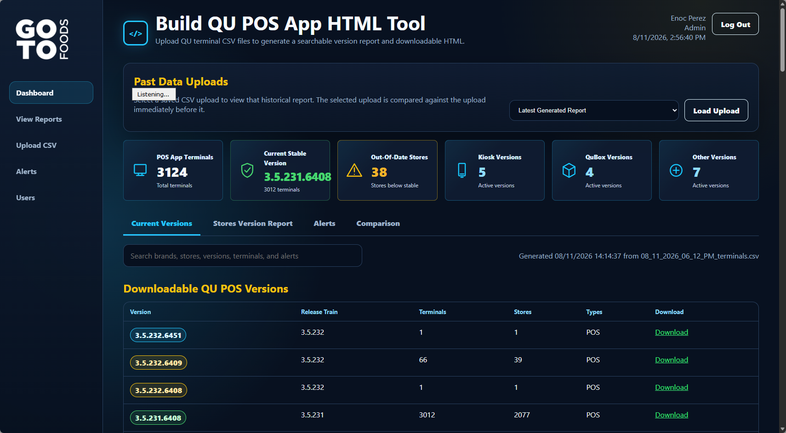

# QU POS Application Version Tools

QU POS Application Version Tools is a web dashboard for tracking QU POS, Kiosk,
QuBox, and other terminal application versions across stores. It turns uploaded
terminal CSV exports into searchable reports, dashboard metrics, alerts, and
historical comparisons.



## What The App Does

- Uploads QU terminal CSV exports and stores each upload as historical data.
- Automatically treats the newest upload as the current dataset and the previous
  upload as the comparison dataset.
- Generates a dashboard showing POS app terminals, current stable version,
  out-of-date stores, Kiosk versions, QuBox versions, and other detected
  versions.
- Provides searchable report tabs for current versions, store version reports,
  alerts, and comparisons.
- Identifies mixed-version stores, stale terminals, stores behind the stable
  version, and version drift.
- Supports store drill-down views with terminal details, versions, terminal
  type, and last-seen data.
- Includes user login, two-factor authentication, and role-based access for
  admin, tech, and read-only users.
- Includes an Admin-only Settings area for users, role permissions, QU EI API
  logs, and configurable API call times.
- Includes optional cloud automation templates for exporting terminals from QU
  Admin and importing the CSV into the web app.
- Includes QU EI Store Information synchronization with SQL storage for the
  latest exported store data.
- Shows dashboard data-health cards for latest terminal sync, latest store sync,
  and QU EI automation status.

## Release Notes

The current application version is `v003.09`.

Release history is tracked in [docs/FEATURE_RELEASES.md](docs/FEATURE_RELEASES.md).
Every completed request receives the next version number and remains available
as historical release notes.

## Roles

- Admin users can upload CSV files, manage users, assign roles, deactivate users,
  delete users, and delete historical upload records.
- Tech users can upload CSV files and generate reports, but cannot delete
  historical records or manage users.
- Read-only users can view dashboards and reports without changing data.

## Project Layout

- `WebApp/` contains the PHP, HTML, CSS, and JavaScript web application.
- `WebApp/api/` contains authentication, upload, report, user, and database APIs.
- `AppData/CloudAutomation/` contains the optional GitHub Actions and Playwright
  automation template.
- `tools/QuApp.IonosPublisher/` contains the SFTP publishing helper source.

## Configuration

Copy `WebApp/config.example.php` to the server-side config file used by your
deployment process and fill in the database settings outside of GitHub.

Do not commit production passwords, SFTP credentials, import tokens, uploaded
CSVs, generated reports, or local deployment files.

## GitHub CSV Automation

The workflows at `.github/workflows/qu-admin-terminal-export.yml` and
`.github/workflows/qu-admin-store-export.yml` can export terminal and store CSV
data from QU Admin and import it into the web app automatically.

Required GitHub repository secrets:

- `QU_ADMIN_USER`
- `QU_ADMIN_PASS`
- `QU_APP_IMPORT_TOKEN`

The workflow can also be run manually from GitHub Actions with `workflow_dispatch`.

If the QU Admin export fails, the workflow uploads a `qu-admin-export-diagnostics`
artifact with a screenshot, page HTML, and error summary for troubleshooting.

## Validation

Useful local checks:

```powershell
node --check .\WebApp\assets\app.js
Get-ChildItem -Path .\WebApp -Recurse -Filter *.php | ForEach-Object { php -l $_.FullName }
```
